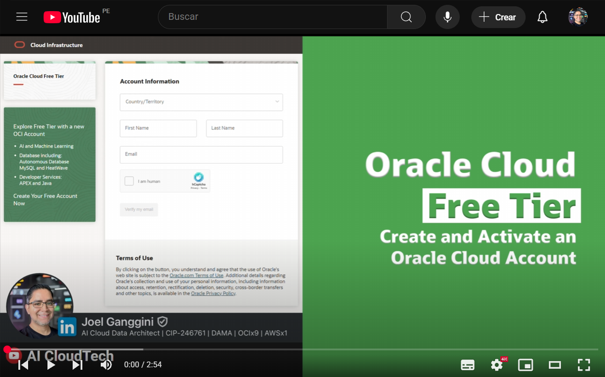

[![Issues][issues-shield]][issues-url]
[![LinkedIn][linkedin-shield]][linkedin-url]

 

  <h1 style="font-size:20px; font-bload">Create and Activate an  Oracle Cloud Account</h1>
  
  <a style="font-size:large;" href="/src/">👨🏽‍💻 Explore the Code »</a>
   
  <a href="https://youtube.com/playlist?list=PLMUWTQHw13gbqqVHaCid3gUBIlvfVKaBu&si=BphBR3Hq2y_EGmnF">🎬 View Demo</a>
  ·
  <a href="https://github.com/jganggini/oci-functions/issues">💣 Report Bug</a>
  ·
  <a href="https://github.com/jganggini/oci-functions/pulls">🚀 Request Feature</a>

  

 

Si no tiene una cuenta, regístrese en [Oracle Cloud](https://www.oracle.com/cloud/free/).

💡 `Nota`: Para garantizar compatibilidad con todos los servicios requeridos, elige una región como `us-chicago-1`.

---

<!-- MARKDOWN LINKS & IMAGES -->
<!-- https://www.markdownguide.org/basic-syntax/#reference-style-links -->
[issues-shield]: https://img.shields.io/github/issues/othneildrew/Best-README-Template.svg?style=for-the-badge
[issues-url]: https://github.com/jganggini/oci-functions/issues
[linkedin-shield]: https://img.shields.io/badge/-LinkedIn-black.svg?style=for-the-badge&logo=linkedin&colorB=555
[linkedin-url]: https://www.linkedin.com/in/jganggini/