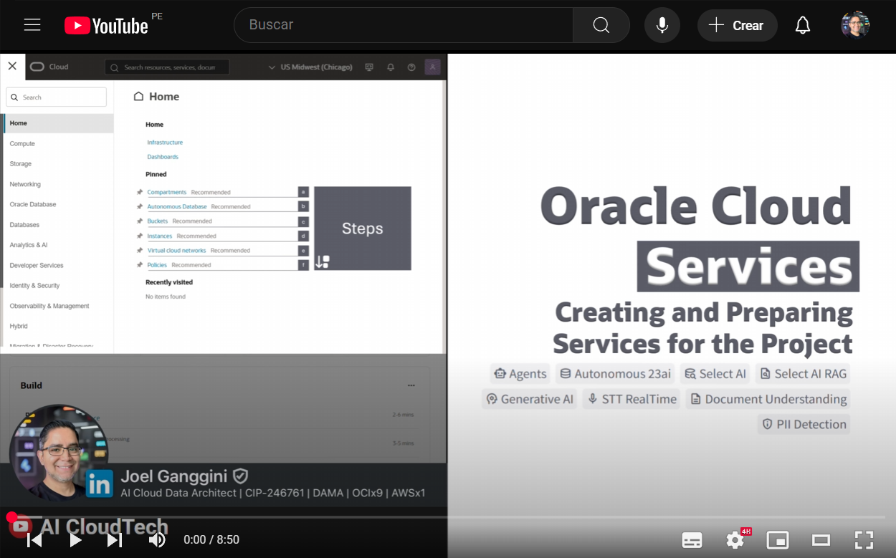

[![Issues][issues-shield]][issues-url]
[![LinkedIn][linkedin-shield]][linkedin-url]

<br />
<div align="center" style="text-align:center;">
  <h1 style="font-size:20px; font-bload">Creating and Preparing<br/>Services for the Project</h1>
  
  <a style="font-size:large;" href="/src/">👨🏽‍💻 Explore the Code »</a>
  <br/>
  <a href="https://youtube.com/playlist?list=PLMUWTQHw13gbqqVHaCid3gUBIlvfVKaBu&si=BphBR3Hq2y_EGmnF">🎬 View Demo</a>
  ·
  <a href="https://github.com/jganggini/oci-functions/issues">💣 Report Bug</a>
  ·
  <a href="https://github.com/jganggini/oci-functions/pulls">🚀 Request Feature</a>
  
  <a href="https://youtu.be/Kj1Rd52-6cY?si=zTiUgM9FOtKR1_AL" target="_blank">
    
  </a>

</div>
<br />

Oracle AI Data Platform, reúne los servicios esenciales para desplegar tu proyecto, incluyendo base de datos, almacenamiento, instancia de cómputo, políticas de acceso y capacidades de inteligencia artificial como Generative AI, análisis de documentos y transcripción en tiempo real y mucho más.

<div align="center" style="text-align:center;">
  <table align="center">
    <tr style="font-size:medium;">
      <td colspan="8">Oracle AI Data Platform</td>
    </tr>
    <tr align="center">
      <td></td>
      <td></td>
      <td></td>
      <td></td>
      <td></td>
      <td></td>
      <td></td>
      <td></td>
    </tr>
    <tr style="font-size:small;">
      <td>Project <br/> Compartment</td>
      <td>Autonomous <br/> Database 23ai</td>
      <td>Object Storage <br/> Bucket</td>
      <td>Compute  <br/> Instance</td>
      <td>Policies <br/> for Services</td>
      <td>Generative AI <br/> for Agents</td>
      <td>Document <br/> Understanding</td>
      <td>Speech <br/> for Realtime</td>
    </tr>
  </table>
</div>

A continuación, se describen los pasos necesarios para crear y configurar los servicios esenciales que utilizará el proyecto dentro de Oracle Cloud. Cada uno de ellos puede activarse desde la consola web siguiendo las indicaciones detalladas en esta guía.

#### a) Create Compartment

- Ingrese a ➡️ `Compartments` ➡️ `Create Compartment`.
- Cree un `compartment` para el proyecto.
  - Name: `oracle-ai-demo`
  - Description: `oracle-ai-demo`
  - Parent Compartment: `Root Compartment`
  - `[Create]`


#### b) Create Autonomous Database 23ai

- Ingrese a ➡️ `Autonomous Database` ➡️ `Create Autonomous Database`.
- Cree un `Data Warehouse` o `Transaction Processing` para el proyecto.
  - Display name: `ADB23AI`
  - Database name: `ADB23AI`
  - Compartment: `oracle-ai-demo`
  - Workload type: `Data Warehouse` o `Transaction Processing`.
  - Database configuration:
    - Choose database version: `23ai`
    - ECPU count: `4`
  - Administrator credentials creation:
    - Password: `password`
    - Confirm password: `password`
  - Network access:
    - Access type: `Secure access from everywhere`
  - `[Create]`

#### c) Create Object Storage Bucket

- Ingrese a ➡️ `Buckets` ➡️ `Create Bucket`.
- Cree un `Bucket` para el proyecto.
  - Bucket name: `ORACLE-AI-RAG`
  - Default Storage Tier: `Standard`
  - Encryption: `Encrypt using Oracle managed Keys`
  - `[Create]`

- Selecionar `Edit Visibility` y editar la visibilidad del bucket para que sea accesible de forma publica 
  - Visibility: `Public`.
  - `[Save Changes]`

#### d) Create Instance Windows (Optional)

Si deseas desplegar y probar el proyecto en la nube, puedes crear temporalmente una instancia de cómputo en Oracle Cloud, lo cual es útil para ejecutar la aplicación en un entorno alojado. Alternativamente, puedes optar por ejecutar el proyecto en tu propia máquina local.

- Ingrese a ➡️ `Compute` ➡️ `Instances`
- Cree una `Instance` para el proyecto.
  - Name: `app`
  - Placement:
    - Availability domain: `AD 1`
  - Image and shape:
    - `[Change Image]`
      - Select an image: `Windows`
      - Image name: `Windows Server 2022 Standar`
      - `[Select image]`
    - `[Change Shape]`
      - Instance type: `Virtual machine`
      - Shape series: `AMD`
      - Shape name: `VM.Standard.E4.Flex`
        - Number of OCPUs: `4`
        - Amount of memory (GB): `64`
      - `[Select Shape]`
  - Network:
    - Primary network: `Create new virtual cloud network`
      - New virtual cloud network name: `vcn-oracle-ai-demo`
      - Create in compartment: `oracle-ai-demo`
      - Subnet: `Create new subnet`
        - New subnet name: `subnet-YYYYMMDD-HHSS`
        - Create in compartment: `oracle-ai-demo`
        - CIDR block: `10.0.0.0/24`
  - `[Create]`

#### e) Virtual Cloud Network (Optional)

- Ingrese a ➡️ `Compute` ➡️ `Instances`
- Seleccione la `Instance` que creaste en el paso anterior.
- Ingrese a ➡️ `Instance details` ➡️ `Virtual cloud network` ➡️ `vcn-oracle-ai-demo`
- Ingrese a ➡️ `Security` ➡️ `Security Lists` ➡️ `Default Security List for vcn-oracle-ai-demo` ➡️ `Security rules`
- `[Add Ingress Rules]`
  - Source Type: `CIDR`
  - Source CIDR: `0.0.0.0/0`
  - IP Protocol: `TCP`
  - Destination Port Range: `3389`
  - Description: `RPD`
- `[+ Another Ingress Rules]`
  - Source Type: `CIDR`
  - Source CIDR: `0.0.0.0/0`
  - IP Protocol: `TCP`
  - Destination Port Range: `8501`
  - Description: `App`
- `[Add Ingress Rules]`  

#### f) Configuring Policies in Identity

- Ingrese a ➡️ `Identity` ➡️ `Policies`
- Se deben configurar las siguientes políticas para permitir el acceso adecuado:

  #### f.1) OCI Document Understanding
  
  ```plaintext
  Allow any-user to manage ai-service-document-family in compartment oracle-ai-demo
  ```
  Read more: [About Document Understanding Policies](https://docs.oracle.com/en-us/iaas/Content/document-understanding/using/about_document-understanding_policies.htm).

  #### f.2) OCI Speech
  
  ```plaintext
  Allow any-user to manage ai-service-speech-family in compartment oracle-ai-demo
  Allow any-user to read tag-namespaces in compartment oracle-ai-demo
  Allow any-user to inspect tag-namespaces in compartment oracle-ai-demo
  ```
  Read more: [About Speech Policies](https://docs.oracle.com/en-us/iaas/Content/speech/using/policies.htm).

  #### f.3) OCI Generative AI
  
  ```plaintext
  Allow any-user to manage generative-ai-family in compartment oracle-ai-demo
  ```
  Read more: [Getting Access to Generative AI](https://docs.oracle.com/en-us/iaas/Content/generative-ai/iam-policies.htm).

  #### f.4) OCI Object Storage: Bucket
  
  ```plaintext
  Allow any-user to read buckets in compartment oracle-ai-demo
  Allow any-user to manage object-family in compartment oracle-ai-demo
  Allow any-user to read objectstorage-namespaces in compartment oracle-ai-demo
  ```

  #### f.5) All Resources (Optional)
  
  Si estás realizando pruebas o laboratorios en una cuenta trial de Oracle Cloud, puedes usar temporalmente la siguiente política para facilitar el acceso sin restricciones:

  ```plaintext
  Allow any-user to manage all-resources in compartment oracle-ai-demo
  ```

  💡 `Nota`: Esta política otorga permisos completos a todos los usuarios autenticados sobre todos los recursos en el tenancy, por lo que debe utilizarse únicamente en entornos controlados, personales y no compartidos. Se recomienda eliminarla una vez finalizadas las pruebas para evitar acciones accidentales o un consumo innecesario de recursos que puedan agotar tu crédito trial.

---

<!-- MARKDOWN LINKS & IMAGES -->
<!-- https://www.markdownguide.org/basic-syntax/#reference-style-links -->
[issues-shield]: https://img.shields.io/github/issues/othneildrew/Best-README-Template.svg?style=for-the-badge
[issues-url]: https://github.com/jganggini/oci-functions/issues
[linkedin-shield]: https://img.shields.io/badge/-LinkedIn-black.svg?style=for-the-badge&logo=linkedin&colorB=555
[linkedin-url]: https://www.linkedin.com/in/jganggini/