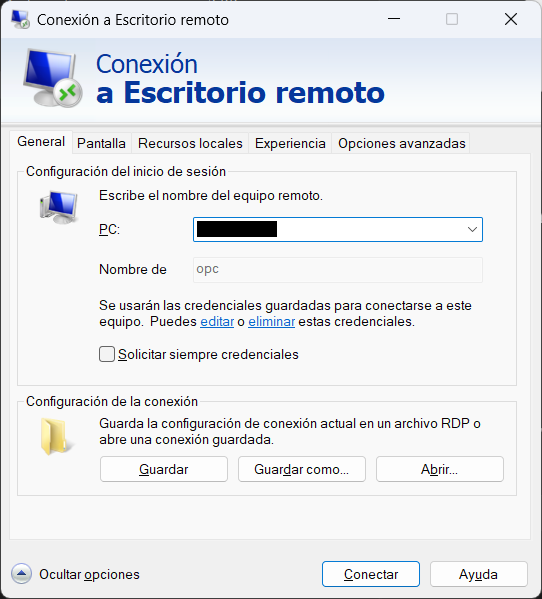
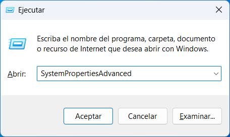
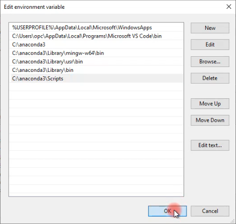
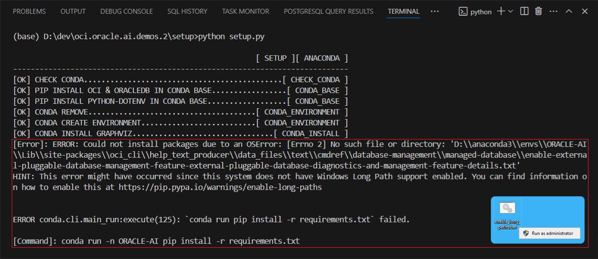
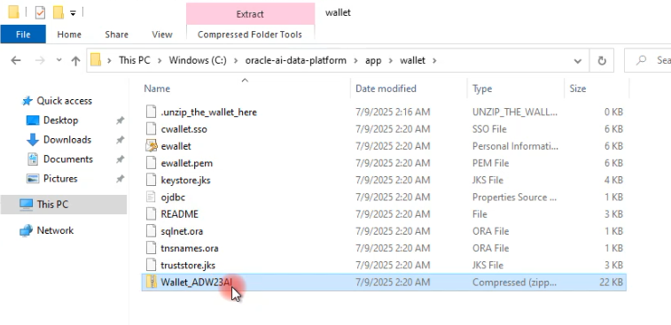
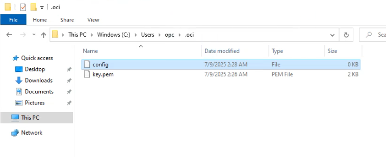

[![Issues][issues-shield]][issues-url]
[![LinkedIn][linkedin-shield]][linkedin-url]

<br />
<div align="center" style="text-align:center;">
  <h1 style="font-size:20px; font-bload">Instance or Local Machine <br/>Configuration (Windows)</h1>
  
  <a style="font-size:large;" href="/src/">👨🏽‍💻 Explore the Code »</a>
  <br/>
  <a href="https://youtube.com/playlist?list=PLMUWTQHw13gbqqVHaCid3gUBIlvfVKaBu&si=BphBR3Hq2y_EGmnF">🎬 View Demo</a>
  ·
  <a href="https://github.com/jganggini/oci-functions/issues">💣 Report Bug</a>
  ·
  <a href="https://github.com/jganggini/oci-functions/pulls">🚀 Request Feature</a>

  <a href="https://youtu.be/yShXrbXXoiI?si=CWjIXjWcSB-4XhXK" target="_blank">
    
  </a>

</div>
<br />

En esta sección se configura el entorno necesario para ejecutar el proyecto, ya sea en una instancia en la nube o en una máquina local. A continuación, se presentan las principales tecnologías que conforman el stack de inteligencia artificial utilizado en la solución.

<div align="center" style="text-align:center;">
  <table align="center">
    <tr style="font-size:medium;">
      <td colspan="5">AI Stack</td>
    </tr>
    <tr align="center">
      <td></td>
      <td></td>
      <td></td>
      <td></td>
      <td></td>
    </tr>
    <tr style="font-size:small;">
      <td>xAI Grok</td>
      <td>Meta</td>
      <td>Cohere</td>
      <td>LangChain</td>
      <td>Streamlit</td>
    </tr>
  </table>
</div>

💡 `Nota`: Los pasos de instalación pueden variar dependiendo del sistema operativo que estés utilizando. Esta guía está enfocada principalmente en sistemas Windows.

- Remote Desktop `(Windows)`:
    - Presiona `[Win + R]`
    - Escribir: `mstsc` y `[Aceptar]`

      
      
    - Ingrese a `Remote Desktop` ➡️
      - PC: `<Public IP Adress>`
      - User: `OPC`
      - Passowrd: `<Initial password>`

#### a) Anaconda (Conda)

Se utiliza Anaconda porque facilita la gestión de entornos y dependencias en proyectos de ciencia de datos e inteligencia artificial, evitando conflictos entre librerías.

- Descargue e instale desde [Anaconda](https://www.anaconda.com/products/distribution).
- Instale:
  - Install for: ✅ `All Users`
  - Destination Folder: `C:\anaconda3`
  - Advanced Installation Options:
    - ✅ Create shortcuts.
    - ✅ Register Acanconda3 as the system Python 3.13
    - ✅ Clear the package cache upon completion.

  - Edit the system environment variables `(Windows)`:
    - Presiona `[Win + R]`
    - Escribir: `SystemPropertiesAdvanced` y `[Aceptar]`

      
    
    - Ingrese a `System Properties` ➡️ `Advanced` ➡️ `[Environment Variables]`
    - Ingrese a `Environment Variables` ➡️ `[Path]` ➡️ `[Edit...]`
    - Ingrese a `Edit enviroment variable` ➡️ `[New]`

      ```plaintext
      C:\anaconda3
      C:\anaconda3\Library\mingw-w64\bin
      C:\anaconda3\Library\usr\bin
      C:\anaconda3\Library\bin
      C:\anaconda3\Scripts
      ```

      

    - `[OK]`

#### b) Visual Studio Code (VSCode)

Visual Studio Code (VSCode) es un editor ligero y potente que ofrece soporte nativo para Python y herramientas como Jupyter, lo que lo hace ideal para desarrollar y probar proyectos de IA.

- Descargue e instale [VSCode](https://code.visualstudio.com/download).
- Instalación por defecto.

#### c) Maximum Path Length Limitation (Windows)

Windows tiene una limitación de 260 caracteres para rutas de archivos, lo que puede causar errores en proyectos con carpetas o dependencias extensas. Para evitarlo, se recomienda habilitar el soporte para rutas largas desde el registro del sistema.

Read more: [Maximum Path Length Limitation](https://learn.microsoft.com/en-us/windows/win32/fileio/maximum-file-path-limitation?tabs=registry).

- Cree el archivo `enable-long-paths.bat` en el escritorio con el siguiente contenido: 

  ```cmd
  @echo off
  :: This script enables support for long file paths in Windows

  echo [INFO] Enabling long path support in the system...
  reg add "HKLM\SYSTEM\CurrentControlSet\Control\FileSystem" /v LongPathsEnabled /t REG_DWORD /d 1 /f

  if %errorlevel% EQU 0 (
      echo [OK] Long paths enabled successfully.
      echo [!] Please restart your computer to apply the changes.
  ) else (
      echo [ERROR] Failed to modify the registry. Run this script as Administrator.
  )

  pause
  ```

  💡 `Nota`: Ejecuta el script como Administrador y reinicia el sistema para aplicar los cambios y evitar errores durante la instalación del entorno.

  

#### d) Copy project to Virtual Machine (Github)

Para copiar el proyecto a la máquina virtual, siga estos pasos:(Github)

- Clonar el Repositorio:
  ```bash
  git clone https://github.com/jganggini/oracle-ai-accelerator.git
  ```
  O descargue el ZIP del repositorio. [Download ZIP](https://github.com/jganggini/oracle-ai-accelerator/archive/refs/heads/main.zip) 

- Cree la siguiente estructura de carpetas:
  - Para Windows:
    ```bash
    mkdir C:\oracle-ai-accelerator
    ```
  - Para MacOS:
    ```bash
    mkdir -p ~/oracle-ai-accelerator
    ```
  - Copie el contenido de la carpeta `oracle-ai-accelerator`.

#### e) Wallet on Autonomus Database 23ai (ADB23ai)

- Ingrese a ➡️ `Autonomous Database`
- Seleccione el `Autonomous Database` que creaste en el paso anterior.
- Ingrese a ➡️ `[Database connection]` ➡️ `[Download wallet]`
  - Ingrese un `Password` para proteger el `wallet`.
  - `[Download]`

- Copie el archivo `wallet.zip` en:
  ```plaintext
  C:\oracle-ai-accelerator/app/wallet
  ```   

  Debera de quedar de la siguiente manera:

  

#### f) Generate API Key

- Ingrese a ➡️ `Identity` ➡️ `profile`
- Seleccione su usuario.
- Ingrese a ➡️ `Tokens and keys` ➡️ `Add API Key` ➡️ `Generate API Key pair` ➡️ `[Download private key]`
  - Seleccione `[Add]`
  - Seleccione `[Copy]`
  
  - Cree el archivo `config` en:
  ```plaintext
  C:\Users\opc\.oci\config
  ```

  - Con el contenido copiado:
  ```plaintext
  [DEFAULT]
  user=ocid1.user.oc1..***********
  fingerprint=**:**:**:**:**:**:**:**:**:**:**:**:**:**:**:**
  tenancy=ocid1.tenancy.oc1..***********
  region=us-chicago-1
  key_file=C:\Users\opc\.oci\key.pem
  ```

- Copie el archivo `key.pem` descargado en:
  ```plaintext
  C:\Users\opc\.oci\key.pem
  ```   

  Debera de quedar de la siguiente manera:

  
  
  💡 `Nota`: El parámetro region en el archivo de configuración de OCI define la región por defecto para tus operaciones. Asegúrate de que coincida con la región donde se encuentra tu bucket de Object Storage; de lo contrario, no podrás acceder a él correctamente.

#### g) Configure Environment Variables (.env)

- Edite el archivo `.env` ubicado en:
  ```plaintext
  C:\oracle-ai-accelerator/app/.env
  ```

#### h) Run Environment Setup Script (setup.py)

Este script configura automáticamente las variables de entorno necesarias y valida los componentes requeridos para el proyecto. 

💡 `Nota`: Asegúrate de haber editado previamente el archivo `.env` con tus datos.

```cmd
conda activate
cd oracle-ai-accelerator
cd setup
python setup.py --windows
```

#### i) Manual Execution (app.py)

Ejecuta manualmente la aplicación principal desde el entorno configurado. Este comando inicia la interfaz web usando `Streamlit` en el puerto `8501`.

```cmd
cd oracle-ai-accelerator
cd app
conda activate oracle-ai
streamlit run app.py --server.port 8501
```

---

<!-- MARKDOWN LINKS & IMAGES -->
<!-- https://www.markdownguide.org/basic-syntax/#reference-style-links -->
[issues-shield]: https://img.shields.io/github/issues/othneildrew/Best-README-Template.svg?style=for-the-badge
[issues-url]: https://github.com/jganggini/oci-functions/issues
[linkedin-shield]: https://img.shields.io/badge/-LinkedIn-black.svg?style=for-the-badge&logo=linkedin&colorB=555
[linkedin-url]: https://www.linkedin.com/in/jganggini/