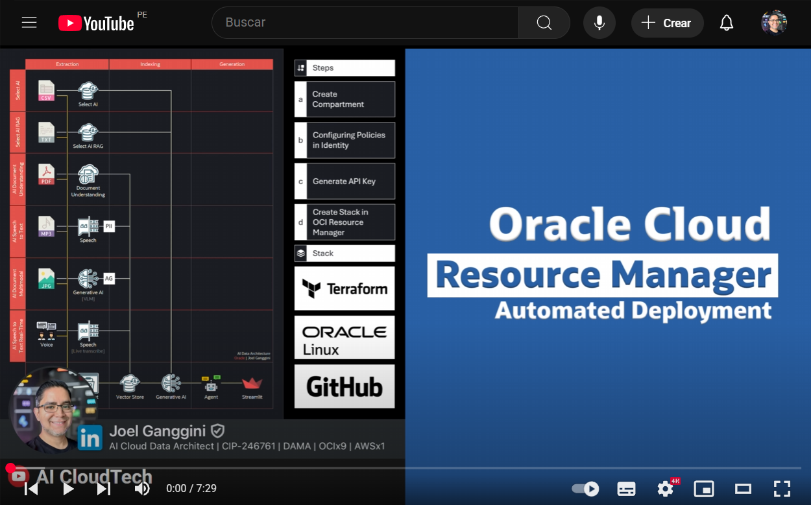
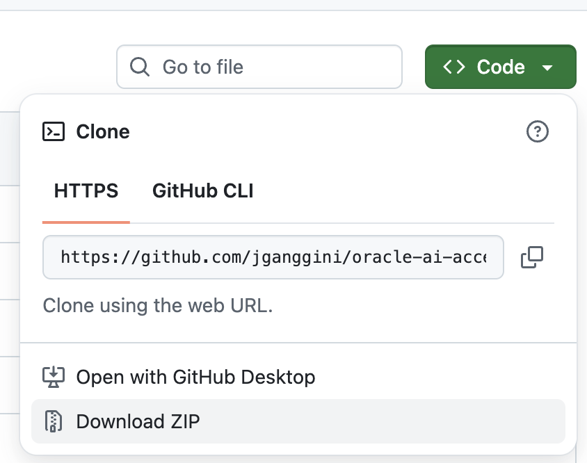
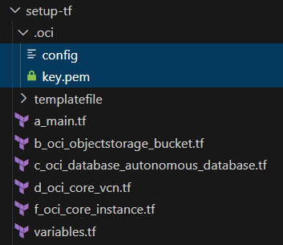
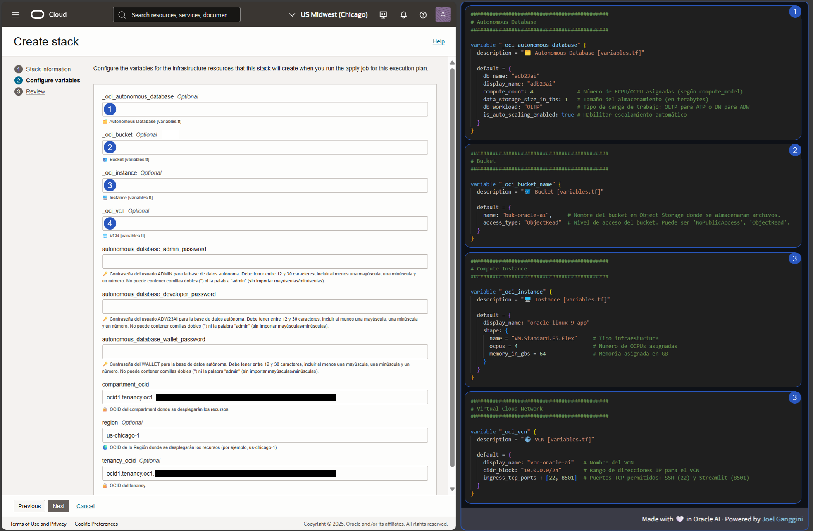
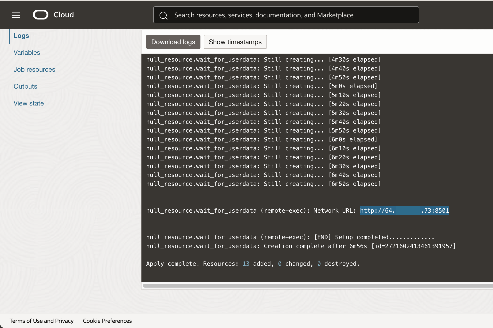
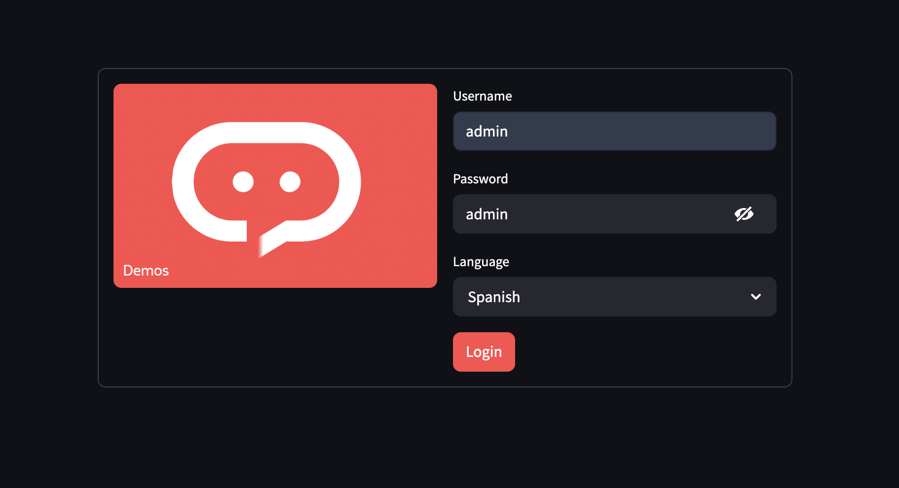

[![Issues][issues-shield]][issues-url]
[![LinkedIn][linkedin-shield]][linkedin-url]

<br />
<div align="center" style="text-align:center;">
  <h1 style="font-size:20px; font-bload">Automated Deployment on<br/>OCI Resource Manager (Linux)</h1>
  
  <a style="font-size:large;" href="/src/">👨🏽‍💻 Explore the Code »</a>
  <br/>
  <a href="https://youtube.com/playlist?list=PLMUWTQHw13gbqqVHaCid3gUBIlvfVKaBu&si=BphBR3Hq2y_EGmnF">🎬 View Demo</a>
  ·
  <a href="https://github.com/jganggini/oci-functions/issues">💣 Report Bug</a>
  ·
  <a href="https://github.com/jganggini/oci-functions/pulls">🚀 Request Feature</a>

  <a href="https://youtu.be/sSQAGSs23uY?si=-PpzOq8PEUVubgVj" target="_blank">
    
  </a>

</div>
<br />

Despliegue automatizado del proyecto en Oracle Cloud (OCI) usando Resource Manager sobre Linux. Incluye instalación de dependencias, configuración del entorno Conda, descarga del wallet y ejecución automática de la app Streamlit mediante `user_data.sh`.

#### Paso 1: Crear el compartment

- Ingrese a ➡️ `Compartments` ➡️ `Create Compartment`.
- Cree un `compartment` para el proyecto.
  - Name: `oracle-ai-demo`
  - Description: `oracle-ai-demo`
  - Parent Compartment: `Root Compartment`
  - `[Create]`

#### Paso 2: Crear las políticas para asignar permisos

Si estás realizando pruebas o laboratorios en una cuenta trial de Oracle Cloud, puedes usar temporalmente la siguiente política para facilitar el acceso sin restricciones:

- Ingrese a ➡️ `Identity & Security` ➡️ `Policies`
- Seleccione `Create Policy` y asigne cualquier nombre y cualquier descripción.
- Si hace clic en el botón `Show manual editor` se abrirá un pequeño panel donde puede pegar la siguiente política.

```plaintext
Allow any-user to manage all-resources in compartment oracle-ai-demo
```

💡 `Nota`: Esta política otorga permisos completos a todos los usuarios autenticados sobre todos los recursos en el tenancy, por lo que debe utilizarse únicamente en entornos controlados, personales y no compartidos. Se recomienda eliminarla una vez finalizadas las pruebas para evitar acciones accidentales o un consumo innecesario de recursos que puedan agotar tu crédito trial.

#### Paso 3: Descargar el repositorio

Clone el Repositorio usando git
```bash
  git clone https://github.com/jganggini/oracle-ai-accelerator.git
```

o descarguelo abriendo [esta url](https://github.com/jganggini/oracle-ai-accelerator) y haciendo clic en `Download ZIP`.



#### Paso 4: Generar la key

- Ingrese a ➡️ `Identity & Security` ➡️ `profile`
- Seleccione su usuario.
- Ingrese a ➡️ `Tokens and keys` ➡️ `Add API Key` ➡️ `Generate API Key pair` ➡️ `[Download private key]`
  - Seleccione `[Add]`
  - Seleccione `[Copy]`
  
  - Copie el texto de configuración `config` sin la última línea

> 🚨 La última línea corresponde a la ruta en la instancia virtual, entonces la última línea debe mantenerse con la ruta /home/opc/.oci/key.pem

  ```plaintext
  [DEFAULT]
  user=ocid1.user.oc1..***********
  fingerprint=**:**:**:**:**:**:**:**:**:**:**:**:**:**:**:**
  tenancy=ocid1.tenancy.oc1..***********
  region=us-chicago-1
  key_file=/home/opc/.oci/key.pem
  ```

En el respositorio descargado encontrará una carpeta setup-tf.

- Copie el texto de configuración [config](setup-tf/config) en
  ```plaintext
  .\setup-tf\.oci\config
  ```
- Sobreescriba el archivo key.pem en la siguiente ruta por el archivo descargado `.pem`.
  ```plaintext
  .\setup-tf\.oci\key.pem
  ```

  El folder debería quedar de la siguiente manera:

  

#### d) Create Stack in OCI Resource Manager

- Ingrese a ➡️ `Resource Manager` ➡️ `Stacks` ➡️ `Create Stack`.
- Cree un `Stack` para el proyecto:

  - Stack infomation:

    - Choose the origin of the Terraform configuration: `My configuration`
    - Stack configuration: `Folder` ➡️ `Browse`
    - Seleccionar la carpeta: [setup-tf](setup-tf)
    - Selecionar `Cargar`
    - Name: `setup-tf-oracle-ai`
    - Description: `setup-tf-oracle-ai`
    - Create in compartment: `oracle-ai-demo`
    - `[Next]`

  - 🛠️ Configuración de `variables` del Stack:

    Al crear el stack en Oracle Cloud, se presentará un formulario con varios campos que corresponden a configuraciones del entorno. Es importante saber **cuáles deben completarse manualmente y cuáles no**

    

    ### ⚠️ Campos que NO deben modificarse en la consola

    Los siguientes campos están **configurados automáticamente** desde el archivo [`variables.tf`](setup-tf/variables.tf).
    **No deben ser editados manualmente desde la consola web.**

    | Campo                        | Descripción                                                 |
    |------------------------------|-------------------------------------------------------------|
    | `_oci_autonomous_database`   | Configuración completa de la base de datos autónoma         |
    | `_oci_bucket_name`           | Nombre del bucket en Object Storage                         |
    | `_oci_instance`              | Configuración de la instancia de cómputo (shape, RAM, etc.) |
    | `_oci_vcn`                   | Configuración de red virtual (VCN y puertos permitidos)     |

    **Estos valores ya están definidos por defecto en `variables.tf` y solo deben modificarse desde el código si es necesario.**

    ### ✅ Campos que SÍ deben completarse manualmente

    Estos campos **sí requieren ser completados** durante la creación del stack:

    | Campo                                    | Descripción                                                                 |
    |------------------------------------------|-----------------------------------------------------------------------------|
    | `autonomous_database_admin_password`     | Contraseña del usuario `ADMIN` de la base de datos (12-30 caracteres, sin `"` ni "admin") |
    | `autonomous_database_developer_password` | Contraseña del usuario `ADW23AI` (mismas restricciones que el admin)       |
    | `autonomous_database_wallet_password`    | Contraseña para el wallet de la base de datos                              |
    | `compartment_ocid`                       | OCID del Compartment donde se desplegarán los recursos                     |
    | `region`                                 | Región donde se desplegará la infraestructura (ej. `us-chicago-1`)         |
    | `tenancy_ocid`                           | OCID del Tenancy                                                           |

    ## 📌 Recomendación

    Para evitar errores de configuración:

    - Modifica únicamente los valores solicitados en esta guía.
    - Si necesitas cambiar configuraciones avanzadas (como shape de instancia o puertos), hazlo **directamente en `variables.tf`** antes de crear el stack.
    - Si el campo tiene un nombre que comienza con guión bajo (`_oci_*`), **no lo toques en la consola**.
    - Las contraseñas deben tener entre 12–30 caracteres, incluir mayúsculas, minúsculas, números, y no contener `"admin"` ni comillas dobles (`"`).

  - Review:

    - Run apply on the created stack?: `Run apply`
    - `[Create]`


#### e) Ingreso a la app

Si el stack fue creado correctamente, los últimos logs mostrarán una url



Esta url muestra una app a la que puede acceder usando las siguientes credenciales.

```plaintext
user: admin
password: admin
```



---

<!-- MARKDOWN LINKS & IMAGES -->
<!-- https://www.markdownguide.org/basic-syntax/#reference-style-links -->
[issues-shield]: https://img.shields.io/github/issues/othneildrew/Best-README-Template.svg?style=for-the-badge
[issues-url]: https://github.com/jganggini/oci-functions/issues
[linkedin-shield]: https://img.shields.io/badge/-LinkedIn-black.svg?style=for-the-badge&logo=linkedin&colorB=555
[linkedin-url]: https://www.linkedin.com/in/jganggini/