[![Issues][issues-shield]][issues-url]
[![LinkedIn][linkedin-shield]][linkedin-url]

<br />
<div align="center" style="text-align:center;">
  <h1 style="font-size:20px; font-bload">Data Model Documentation</h1>
  
  <a style="font-size:large;" href="/src/">👨🏽‍💻 Explore the Code »</a>
  <br/>
  <a href="https://youtube.com/playlist?list=PLMUWTQHw13gbqqVHaCid3gUBIlvfVKaBu&si=BphBR3Hq2y_EGmnF">🎬 View Demo</a>
  ·
  <a href="https://github.com/jganggini/oci-functions/issues">💣 Report Bug</a>
  ·
  <a href="https://github.com/jganggini/oci-functions/pulls">🚀 Request Feature</a>

</div>
<br />

Este modelo de datos está diseñado para una plataforma de análisis documental asistida por inteligencia artificial. Su objetivo es permitir a usuarios gestionar archivos, módulos funcionales, agentes de IA y análisis vectorial sobre fragmentos de documentos. Ofrece mecanismos de control de acceso, soporte para múltiples módulos AI y registro de metadatos enriquecidos.

<p align="center">
  
</p>

<div align="center" style="text-align:center;">
  Modelo: <a href="https://raw.githubusercontent.com/jganggini/oracle-ai/187534d131828be7e586b4ee0dff4b816d218fde/oracle-ai-data-platform/img/data-model.svg">Mermaidchart</a>
</div> 

#### a) Table Description and Initial Content

#### a.1) `USER_GROUP`

Agrupa a los usuarios según su rol, organización o permisos. Cada grupo puede tener múltiples usuarios.

| Campo                   | Tipo            | Descripción                                 |
|-------------------------|-----------------|---------------------------------------------|
| `user_group_id`         | NUMBER (PK)     | Identificador único del grupo               |
| `user_group_name`       | VARCHAR2(250)   | Nombre del grupo                            |
| `user_group_description`| VARCHAR2(500)   | Descripción textual                         |
| `user_group_state`      | NUMBER          | Estado del grupo (1 = activo)               |
| `user_group_date`       | TIMESTAMP       | Fecha de creación                           |

#### a.2) `USERS`

Usuarios registrados en la plataforma. Cada usuario está vinculado a un grupo.

| Campo                  | Tipo             | Descripción                                 |
|------------------------|------------------|---------------------------------------------|
| `user_id`              | NUMBER (PK)      | Identificador único del usuario             |
| `user_group_id`        | NUMBER (FK)      | Clave foránea a `user_group`                |
| `user_username`        | VARCHAR2(250)    | Nombre de usuario único                     |
| `user_password`        | VARCHAR2(500)    | Contraseña de ingreso                       |
| `user_sel_ai_password` | VARCHAR2(500)    | Contraseña para servicios AI                |
| `user_name`            | VARCHAR2(500)    | Nombre del usuario                          |
| `user_last_name`       | VARCHAR2(500)    | Apellido del usuario                        |
| `user_email`           | VARCHAR2(500)    | Correo electrónico                          |
| `user_modules`         | CLOB (JSON)      | Lista de módulos asignados (formato JSON)   |
| `user_state`           | NUMBER           | Estado del usuario (1 = activo)             |
| `user_date`            | TIMESTAMP        | Fecha de registro

**Contenido inicial:**

```sql
INSERT INTO users (
    user_id, user_group_id, user_username, user_password, user_sel_ai_password,
    user_name, user_last_name, user_email, user_modules
) VALUES (
    0, 0, 'admin', 'admin', 'p_a_s_s_w_o_r_d',
    'Joel', 'Ganggini', 'joel.ganggini@correo.com', '[0, 1, 2, 3, 4, 5, 6]'
);
```

#### a.3) `MODULES`

Define los módulos funcionales que ofrece el sistema para el procesamiento de datos (p. ej. extracción de texto, RAG, OCR, etc).

| Campo                  | Tipo             | Descripción                                    |
|------------------------|------------------|------------------------------------------------|
| `module_id`            | NUMBER (PK)      | Identificador único del módulo                 |
| `module_name`          | VARCHAR2(250)    | Nombre del módulo                              |
| `module_folder`        | VARCHAR2(250)    | Carpeta asociada al módulo (backend/frontend)  |
| `module_src_type`      | VARCHAR2(250)    | Tipos de archivo de entrada (CSV, PDF, etc.)   |
| `module_trg_type`      | VARCHAR2(250)    | Tipos de archivo de salida (TXT, JSON, etc.)   |
| `module_vector_store`  | NUMBER           | Soporte para embeddings (1 = sí)               |
| `module_state`         | NUMBER           | Estado (1 = activo)                            |
| `module_date`          | TIMESTAMP        | Fecha de registro                              |

**Contenido inicial:**

```sql
INSERT INTO modules (module_id, module_name) VALUES (0, 'Administrator');
INSERT INTO modules (...) VALUES (1, 'Select AI', 'module-select-ai', 'CSV', 'Autonomous Database');
INSERT INTO modules (...) VALUES (2, 'Select AI RAG', 'module-select-ai-rag', 'TXT, HTML, DOC, JSON, XML', 'Autonomous Database');
INSERT INTO modules (...) VALUES (3, 'AI Document Understanding', 'module-ai-document-understanding', 'PDF, JPG, PNG, TIFF', 'PDF, JSON', 1);
INSERT INTO modules (...) VALUES (4, 'AI Speech to Text', 'module-ai-speech-to-text', 'M4A, MKV, MP3, MP4, OGA, OGG, WAV', 'TXT, SRT', 1);
INSERT INTO modules (...) VALUES (5, 'AI Document Multimodal', 'module-ai-document-multimodal', 'JPEG, PNG', 'MD', 1);
INSERT INTO modules (...) VALUES (6, 'AI Speech to Text Real-Time', 'module-ai-speech-to-realtime', 'JSON', 'TXT', 1);
```

#### a.4) `AGENT_MODELS`

Modelos de IA configurables para los agentes (LLM, VLM, etc.).

| Campo                         | Tipo             | Descripción                                   |
|-------------------------------|------------------|-----------------------------------------------|
| `agent_model_id`              | NUMBER (PK)      | Identificador único del modelo                |
| `agent_model_name`            | VARCHAR2(250)    | Nombre del modelo (identificador externo)     |
| `agent_model_type`            | VARCHAR2(100)    | Tipo (`llm`, `vlm`)                           |
| `agent_model_provider`        | VARCHAR2(250)    | Proveedor del modelo (meta, cohere, etc.)     |
| `agent_model_service_endpoint`| VARCHAR2(500)    | Endpoint (placeholder por defecto)            |
| `agent_model_state`           | NUMBER           | Estado (1 = activo)                           |
| `agent_model_date`            | TIMESTAMP        | Fecha de registro                             |

**Contenido inicial:** 11 modelos entre `cohere`, `meta`, `xai`.

#### a.5) `AGENTS`

Agentes configurados que usan un modelo para ejecutar tareas de QA, OCR, PII, etc.

| Campo                      | Tipo             | Descripción                                   |
|----------------------------|------------------|-----------------------------------------------|
| `agent_id`                 | NUMBER (PK)      | Identificador único del agente                |
| `agent_model_id`           | NUMBER (FK)      | Referencia a modelo en `agent_models`         |
| `agent_name`               | VARCHAR2(250)    | Nombre del agente                             |
| `agent_description`        | VARCHAR2(4000)   | Descripción de la funcionalidad               |
| `agent_type`               | VARCHAR2(250)    | Tipo (`Chat`, `Extraction`, etc.)             |
| `agent_max_out_tokens`     | NUMBER           | Máx. de tokens generados                      |
| `agent_temperature`        | NUMBER (1,1)     | Parámetro de diversidad                       |
| `agent_top_p`              | NUMBER (3,2)     | Nucleus sampling                              |
| `agent_top_k`              | NUMBER (3,0)     | Top-K sampling                                |
| `agent_frequency_penalty`  | NUMBER (3,2)     | Penalización por frecuencia                   |
| `agent_presence_penalty`   | NUMBER (3,2)     | Penalización por presencia                    |
| `agent_prompt_system`      | VARCHAR2(4000)   | Prompt del sistema                            |
| `agent_prompt_message`     | VARCHAR2(4000)   | Mensaje inicial opcional                      |
| `agent_state`              | NUMBER           | Estado del agente                             |
| `agent_date`               | TIMESTAMP        | Fecha de creación                             |

**Contenido inicial:** 5 agentes:
- Document Agent
- SRT Audio Agent
- PII Anonymizer Agent
- Image Analysis Agent
- Image OCR Analysis Agent

#### a.6) `AGENT_USER`

Relación entre usuarios y agentes, incluyendo propiedad.

| Campo             | Tipo             | Descripción                             |
|-------------------|------------------|-----------------------------------------|
| `agent_user_id`   | NUMBER (PK)      | Identificador único de relación         |
| `agent_id`        | NUMBER (FK)      | Agente compartido o propio              |
| `user_id`         | NUMBER (FK)      | Usuario propietario o colaborador       |
| `owner`           | NUMBER           | 1 = Propietario, 0 = Compartido         |
| `agent_user_state`| NUMBER           | Estado de relación                      |
| `agent_user_date` | TIMESTAMP        | Fecha de asignación                     |

**Contenido inicial:** Admin (`user_id = 0`) posee los 5 agentes.

#### a.7) `FILES`

Archivos subidos para análisis en los módulos.

| Campo                    | Tipo             | Descripción                              |
|--------------------------|------------------|------------------------------------------|
| `file_id`                | NUMBER (PK)      | Identificador único del archivo          |
| `module_id`              | NUMBER (FK)      | Módulo donde se subió el archivo         |
| `file_src_file_name`     | VARCHAR2(500)    | Nombre original del archivo              |
| `file_src_size`          | NUMBER           | Tamaño en bytes                          |
| `file_src_strategy`      | VARCHAR2(500)    | Estrategia de extracción aplicada        |
| `file_trg_obj_name`      | VARCHAR2(4000)   | Nombre del objeto generado               |
| `file_trg_extraction`    | CLOB             | Contenido extraído                       |
| `file_trg_tot_pages`     | NUMBER           | Páginas totales (si aplica)              |
| `file_trg_tot_characters`| NUMBER           | Total de caracteres extraídos            |
| `file_trg_tot_time`      | VARCHAR2(8)      | Tiempo total de audio (hh:mm:ss)         |
| `file_trg_language`      | VARCHAR2(3)      | Idioma (`esa`, `en`, etc.)               |
| `file_trg_pii`           | NUMBER           | Indicador si contiene PII                |
| `file_description`       | VARCHAR2(500)    | Descripción manual                       |
| `file_version`           | NUMBER           | Versión del archivo                      |
| `file_state`             | NUMBER           | Estado (1 = activo)                      |
| `file_date`              | TIMESTAMP        | Fecha de carga                           |

#### a.8) `FILE_USER`

Relación entre usuarios y archivos, con control de propiedad y acceso.

| Campo            | Tipo             | Descripción                             |
|------------------|------------------|-----------------------------------------|
| `file_user_id`   | NUMBER (PK)      | ID único de relación                    |
| `file_id`        | NUMBER (FK)      | Archivo referenciado                    |
| `user_id`        | NUMBER (FK)      | Usuario que accede o es dueño           |
| `owner`          | NUMBER           | 1 = Propietario                         |
| `file_user_state`| NUMBER           | Estado de acceso                        |
| `file_user_date` | TIMESTAMP        | Fecha de asignación                     |

#### a.9) `DOCS`

Fragmentos extraídos de archivos que se transforman en vectores semánticos.

| Campo      | Tipo         | Descripción                                 |
|------------|--------------|---------------------------------------------|
| `id`       | NUMBER (PK)  | ID único del fragmento                      |
| `file_id`  | NUMBER (FK)  | Archivo al que pertenece                    |
| `text`     | CLOB         | Texto del fragmento                        |
| `metadata` | CLOB         | Información adicional                      |
| `embedding`| VECTOR       | Embedding vectorial para búsqueda semántica |

- Índice: `docs_hnsw_idx` (similaridad coseno con precisión 95%)
- Trigger y secuencia de auto-incremento activados

#### b) Key Relationships

| Relación                         | Tipo     | Descripción                                        |
|----------------------------------|----------|----------------------------------------------------|
| `USER_GROUP` ⟶ `USERS`          | 1:N      | Un grupo contiene varios usuarios.                 |
| `AGENT_MODELS` ⟶ `AGENTS`       | 1:N      | Un modelo puede ser usado por muchos agentes.      |
| `USERS` ⟷ `AGENTS`              | N:M      | Mediante `AGENT_USER`.                             |
| `USERS` ⟷ `FILES`               | N:M      | Mediante `FILE_USER`.                              |
| `MODULES` ⟶ `FILES`             | 1:N      | Un módulo genera múltiples archivos.               |
| `FILES` ⟶ `DOCS`                | 1:N      | Un archivo puede tener múltiples fragmentos.       |

#### c) Additional Considerations

- Las relaciones `*_USER` (`AGENT_USER`, `FILE_USER`) permiten control granular de permisos, incluyendo el campo `OWNER`.
- `user_modules` permite flexibilidad al almacenar asignaciones como JSON en vez de una relación tradicional.
- `DOCS.embedding` es un campo tipo `VECTOR`, lo que indica que este modelo soporta búsquedas semánticas o recuperación basada en similitud.

---

<!-- MARKDOWN LINKS & IMAGES -->
<!-- https://www.markdownguide.org/basic-syntax/#reference-style-links -->
[issues-shield]: https://img.shields.io/github/issues/othneildrew/Best-README-Template.svg?style=for-the-badge
[issues-url]: https://github.com/jganggini/oci-functions/issues
[linkedin-shield]: https://img.shields.io/badge/-LinkedIn-black.svg?style=for-the-badge&logo=linkedin&colorB=555
[linkedin-url]: https://www.linkedin.com/in/jganggini/